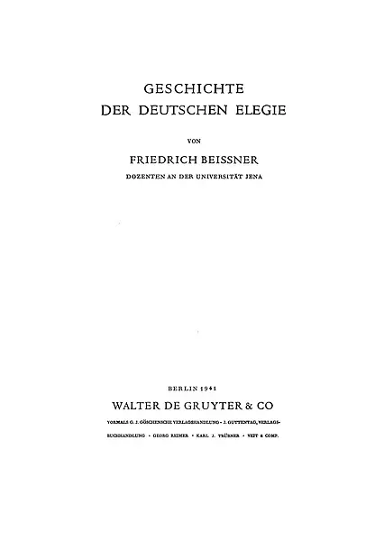
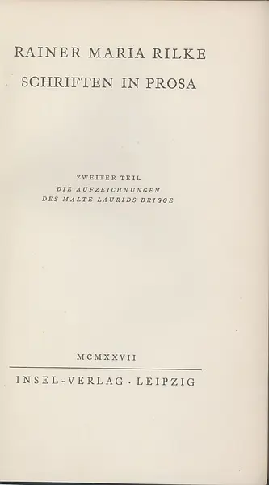

Dasha藏书（ http://book.douban.com/doulist/87150/ ）之补遗

2012-07-02 20:59:58 更新

Ausgewählte Gedichte. Ill. von Max Slevogt. Frankfurt am Main : Insel-Verlag, 1975; Euro 104,00 + 27,80  
——2010-08-17 04:56:52 

显微无间 2011-10-31 23:15:57  
Dasha，那个，我弱弱地问一句噢........读这么多书，真的就很快乐嘛？
 
Dasha 2011-10-31 23:35:00  
傻以为，任何事情都能致人快乐与痛苦，读书只是其中一种。

Les Cahiers de Malte Laurids Brigge. par Rainer Maria Rilke, Illustrés par Hermine David. Emile-Paul, Paris, 1942: 182,10 EUR  
——2010-08-17 05:15:25 

Nachdr. der Ausg. Straßburg, Leipzig, Kattentidt, 1894(http://www.freunde-sbb.de/de/shop/)。但是，根据里尔克1894年前后拼写习惯，此书犹非“翻印”，似在“仿印”。  
——2010-08-17 15:58:51 

Rilke, Das Stunden-Buch. Das Buch vom mönchischen Leben. hrsg. von Ruth Mövius. Insel, 1936. Faksimiledruck  
——2010-08-17 16:00:17 

R. M. Rilkes neue Gedichte. Ihr zyklisches Gefüge. von Brigitte L. Bradley  
——2010-08-17 16:00:59 

Rilke, Larenopfer. 1896. Bayerische Staatsbibliothek, Rar. 1219 (172,70 EUR)  
——2010-08-17 16:19:38 

Rilke, Das Stunden-Buch. Insel-Verlag, Leipzig, 1905. Bayerische Staatsbibliothek, L.sel.l 2229 (44,00 EUR)  
——2010-08-17 16:20:00 

Rilke, Traumgekrönt. P. Friesenhahn, 1897. Digitalisiert von Bayerische Staatsbibliothek, BSB10A007640 (32,36 EUR)  
——2010-08-17 16:24:05 

Rilke, Das Buch der Bilder. 5. Auflage. Leipzig Im Insel-Verlag, 1913  
——2010-08-21 11:31:15 

Aus Rainer Maria Rilkes Nachlass / Folge 1. Aus dem Nachlass des Grafen C. W., 1950  
——2010-08-21 11:31:48 

Aus Rainer Maria Rilkes Nachlass / Folge 2. Briefwechsel in Gedichten mit Erika Mitterer, 1950  
——2010-08-21 11:32:21 

Aus Rainer Maria Rilkes Nachlass / F. 3. "Aus Taschen-Büchern und Merk-Blättern - in zufälliger Folge - 1925", 1950  
——2010-08-21 11:32:52 

Aus Rainer Maria Rilkes Nachlass / F. 4. [Die Briefe an Gräfin Sizzo], 1950  
——2010-08-21 11:33:22 

Geschichte der deutschen Elegie. von Friedrich Beissner. Berlin: de Gruyter, 1941  
——2010-08-23 10:38:34 

Geschichte der deutschen Ode. von Karl Viëtor. Darmstadt : Wissenschaftl. Buchgesellsch., 1961. 2 Aufl.  
——2010-08-23 10:38:44 

Formen der Elegie von Goethe bis Celan. von Klaus Weissenberger. Bern; München : Francke, 1969  
——2010-08-23 10:43:00 

Studien zur Geschichte der deutschen Hymne. von Norbert Gabriel. http://book.douban.com/subject/3530165/  
——2010-08-23 10:43:15 

Rainer Maria Rilkes Stunden-Buch. Entstehung und Gehalt. von Ruth Mövius. Leipzig: Insel-Verlag, 1937  
——2010-08-24 03:12:08 

一只翅膀(想要一只深爱我的动物) 2011-07-07 22:11:50  
你有这书？你在哪？这书借么？

一只翅膀(想要一只深爱我的动物) 2011-07-07 22:19:43  
我想求其中的一页，能不能麻烦你扫描或者照片一下？38页左右有两张图。。。迫切想要，拜托拜托。。。是MARIA MIT DEM KINDE UND LEUCHTER TRAGENDEN ENGELN ABB. 36 A UND B，还有它附近的一张图。。。研究需要，敬请帮忙。谢谢谢谢。

一只翅膀(想要一只深爱我的动物) 2011-07-07 22:26:59  
你网页上能下到的这本书的PDF只有从160余页开始的，而这两张图却除了这本书再无可考，原作也听闻已经被毁。所以，如果你真有这本书的整本，但求帮忙扫描一下，谢谢。

Dasha 2011-07-07 23:41:05
我在中国，如果你在柏林，此书不难找啊，我是从德国买的，因为中国海关的原因，最终买了两本：
http://tan.kongfz.com/38954/3800189/

两张图片已经为您上传到115：  
http://u.115.com/file/e6vqhfj5  
http://u.115.com/file/clt9bzr6  

但是，波提切利的画别的书里也有啊，比如：  
http://www.archive.org/details/workofbotticelli00bottiala  

一只翅膀(想要一只深爱我的动物) 2011-07-08 00:15:55  
各种感谢，谢谢谢谢。  
我在找他所有描写过的画的ABBILUNG，比如 Francisco Goya 的La ballerina Carmen la gitana，刚在“http://blog.myspace.cn/e/406193697.htm” 里发现你也没找到呢，呵呵。太巧。  

Dasha 2011-07-08 00:26:15  
问题是，Dasha怀疑德国人给出的画名可能与现行的名称不一致，所以不好查。Dasha找到的许多画的情形都是如此。  

一只翅膀(想要一只深爱我的动物) 2011-07-08 00:38:00  
原来如此？画名难道不是唯一的？难度大啊。。。

Dasha 2011-07-08 09:03:23  
似乎因为画的名，画家并不直接写在画上，所以，名字变得不确定，比如
Paula Modersohn-Becker目前通称为“Selbstbildnis nach Halblinks mit Hand am Kinn”的画，在KA I（ https://book.douban.com/subject/2142478/ ）里被称为“Selbstportrait mit der Hand am Kinn”。Goya那幅，也是名字对不上，一时无迹可寻。此外，就是文字作品名，也有可能被后来者篡改，比如Rilke的“Die Berufung”，在NG II的1908、1918、1919版和GW中均如此，到了SW里就被改为“Mohammeds Berufung”，而且，改名，并不是据里尔克的手稿，只是以里尔克在一封信里的解释。  
兄在读Rilke？很愿意与兄交流。诗中所涉及的绘画、雕塑，https://book.douban.com/subject/2285372/ 和https://book.douban.com/subject/4299987/ 有一部分。此书未扫描部分，是Ruth Mövius自己的研究，而非里尔克的作品。

一只翅膀(想要一只深爱我的动物) 2011-07-08 15:47:41  
不是我，是我老公。德国人，学符号学的，在写博士论文，其中一个章节是研究RILKE，我帮他找找图啊什么的。他应该已经给你发邮件表示感谢了。你是RILKE专家啊，我们表示非常佩服。非常乐意能听你对RILKE的高见并交流。

Dasha 2011-07-08 21:57:59  
好家伙，夫唱妇随，真真羡莎人。我媳妇就不管我，自顾自，而且还挖苦说我净喜欢“二尾子”，不如喜欢荷尔德林（傻按，荷尔德林Dasha当然最喜欢，不过，荷尔德林不也有问题——“奸夫”以及“疯子”？）
大概明后天，Dasha就能完成从前年10月开始的对里尔克德语诗的“遍历”。里尔克相关的绘画、雕塑资料Dasha似乎都已经查询了一遍，硬盘里应该都有图片。如果你相公需要什么，不妨开口。

邮件发到哪里了，Dasha没有收到。不是为了看你们的感谢，是Dasha目前阅读中有一些词，格林词典里也没有，网络搜不到，很是想求教的，不知是否方便。

Gesammelte Briefe: B99-02, B02-06, B06-07, B07-14, B14-21, B21-26，但B99-02实际到00  
——2010-08-24 10:30:02 

TF: Tagebücher aus der Frühzeit / Rainer Maria Rilke. Hrsg. v. Ruth Sieber-Rilke ; Carl Sieber. Leipzig: Insel-Verl. , 1942  
——2010-08-24 10:35:21 

Rainer Maria Rilke, Briefe an seinen Verleger. 1906 bis 1926. Leipzig: Insel-Verl., 1936  
——2010-08-24 10:39:08 

René Rilkes Prager Jahre / Peter Demetz. Düsseldorf: Diederichs, 1953  
——2010-08-24 12:49:07 

Rainer Maria Rilkes frühe Lyrik / Kurt Berger. Marburg: Elwert'sche Verlh., 1931  
——2010-08-24 12:49:43 

Der späte Rilke / Dieter Bassermann. Essen ; Freiburg i. Br. : v. Chamier, 1948, 2. Aufl.  
——2010-08-24 12:50:33 

Rainer Maria Rilke: Ein Beitrag. von Katharina Kippenberg. Leipzig: Insel-Verlag, 1942. 3. Ausgabe  
——2010-08-24 16:33:02 

Rainer Maria Rilkes Duineser Elegien und Sonette an Orpheus. von Katharina Kippenberg. Leipzig: Insel-Verlag, 1946  
——2010-08-24 16:33:44 

Briefwechsel / Rainer Maria Rilke; Katharina Kippenberg. Hrsg. von Bettina von Bomhard. Wiesbaden: Insel-Verlag, 1954  
——2010-08-24 16:34:16 

Die Weise von Liebe und Tod des Cornets Christoph Rilke. Im Insel-Verlag, Leipzig 1922, Insel-Bücherei Nr. 1, 231. bis 251.  
——2010-08-27 14:14:49 

Die Weise von Liebe und Tod des Cornets Christoph Rilke. Faksimile-Ausgabe (nach der ersten Ausgabe von 1912) wurde im Juni 1978  
——2010-08-27 14:15:30 

Rilke, Das Marien-Leben. Im Insel-Verlag zu Leipzig o.J. [1913], Insel-Bücherei Nr. 43 (3. Auflage)  
——2010-08-27 14:16:00 

Rilke, Gedichte in französischer Sprache. Die Herausgabe besorgte Thankmar Freiherr von Münchhausen. Insel-Verlag, 1949  
——2010-08-27 14:16:22 

Stefan Zweig, Abschied von Rilke : Eine Rede. Tübingen : R. Wunderlich, 1928  
——2010-08-27 14:17:01 

Elisabeth von Schmidt-Pauli, Hiersein ist Herrlich. Konstanz-Nussdorf: Internationaler Verlag, 1948  
——2010-08-27 14:53:27 

Agnes Geering, Rainer Maria Rilkes Sonette an Orpheus: Versuch einer Einfuhrung. Frankfurt a.M.: Knecht, 1948  
——2010-08-27 14:54:28 

Heinrich Kreutz, Rilkes Duineser Elegien: Eine Interpretation. München: Beck, 1950  
——2010-08-27 14:56:16 

Heinrich Cämmerer, Rilkes Duineser Elegien: Deutung der Dichtung. Stuttgart: Metzler, 1937  
——2010-08-27 14:59:06 

Hermann Mörchen, Rainer Maria Rilkes Sonette an Orpheus. Versuch einer Einführung. Stuttgart: Kohlhammer, 1958  
——2010-08-27 15:02:58 

Wolfgang Schneditz, Rilke und die bildende Kunst: Versuch einer Deutung. Graz: Kienreich, 1947. 2. Aufl.  
——2010-08-27 15:03:38 

Rainer Maria Rilke und die bildende Kunst. Baden-Baden: Klein, 1951. Kunstwerk-Schriften ; Bd. 24  
——2010-08-27 15:03:55 

Alfred Hermann, Rilkes ägyptische Gesichte. Darmstadt: Wissenschaftliche Buchges, 1966  
——2010-08-27 15:09:26 

Rilke, Frühling: für Katharina Kippenberg. Marbach (am Neckar) : Schiller-Nationalmuseum, 1975  
——2010-08-27 15:10:06 

Hellmut Kruse, Wolf Graf von Kalckreuth: Ein frühvollendeter Dichter. Hamburg-Blankenese: Kröger, 1949  
——2010-08-27 15:20:36 

Marianne Sievers, Die biblischen Motive in der Dichtung Rainer Maria Rilkes. Berlin. Ebering, 1938. Germanische Studien; H. 202  
——2010-09-06 14:01:13 

Regina Ullmann, Erinnerungen an Rilke. St. Gallen. Tschudy-Verlag, 1945  
——2010-09-06 14:01:35 

Sophie Brutzer, Rilkes russische Reisen. Darmstadt. Wissenschaftliche Buchges, 1969. Unveränd. Nachdr. d. Ausg. 1934  
——2010-09-06 14:02:00 

リルケ全集 富士川英郎責任編集 彌生書房、1973-74 改訂版（全7巻）  
——2010-10-29 15:30:39 

Dasha 2010-10-29 15:56:19  
塚越敏那套也想买，就是太贵。

Dasha 2010-10-29 22:22:24  
便宜的：80,000円(http://search.newgenji.co.jp/sgenji/D1/?000107611967/)   
昂贵的：157,500円(http://search.newgenji.co.jp/sgenji/D1/?000100583856/)   
倒是能买得起，只是觉得太不值得了

售价14,000円  
——2010-10-29 15:30:55 

Dasha花费人民币2178.00  
——2010-10-29 15:31:10 

April_Hot 2010-10-29 15:39:34  
為啥這麼貴？。。。

Dasha 2010-10-29 15:50:19  
是国际邮费贵。塚越敏那套更贵。Dasha也就是随便翻翻，日译本也不比汉译本好多少，李魁贤的许多里尔克译文就是依据这套书翻译的，藉此应该更能看出他错译的根源。

感谢“中古店主”（http://trade.taobao.com/trade/detail/trade_snap.htm?tradeID=50761399306294）  
——2010-10-29 15:31:29 

书都收到了，淘宝上还显示着“等待卖家发货”  
——2010-10-29 15:31:48 

——2010-10-29 15:32:33 

國朝大濕劉小瘋(你能不能不要這麼嫵媚？) 2010-10-29 17:30:18  
Rilke。。。是三诗人......“手纸”吗？腰封上“手纸”好多啊。。。囧

Dasha 2010-10-29 18:09:57  
若き詩人への手紙：给青年诗人的十封信  
ロダンへの手紙：与罗丹书信集  
ベンヴェヌータへの手紙：与Benvenuta书信集  
サロメへの手紙：与莎乐美书信集  
妻への手紙〈セザンヌ書簡〉：与妻书“论塞尚”  
タクシス侯爵夫人への手紙：与塔克席斯侯爵夫人书信集  

傻按：所谓“里尔克全集”，包括德语原文的SW，根本离“全”差远了，尤其是出于私人意图而非隐私而略去的那些……，所以，SW里也不包含那本《三诗人书简》。

——2010-10-29 15:32:47 

René Rilke: Die Jugend Rainer Maria Rilkes. von Carl Sieber. Leipzig: Insel-Verlag, 1932。2010年11月12日，收到Barbara Maag大大姐代购的此书。  
——2010-11-12 13:26:08 

蓝色不忧郁(Gate gate paragate) 2010-11-12 13:39:50  
多少德国马克？

Dasha 2010-11-12 15:20:19  
22,50 Euro

Wege mit Rilke. von Lou Albert-Lasard. Frankfurt am Main: S. Fischer, 1952.
连同运费，共160元人民币：Ach wehe, meine Mutter reißt mich ein  
——2011-04-22 09:59:21 

Le pauvre Holterling Nr. 1（6月22日收到）  
——2011-06-23 20:47:37 

Briefwechsel / Rainer Maria Rilke u. Marie von Thurn und Taxis. Niehans & Rokitansky, Insel-Verlag, 1951（6月22日收到）  
——2011-06-23 20:47:39 

Rilkes Zyklus "Aus dem Nachlaß des Grafen C. W.": Versuch e. Eingliederg in Rilkes Werk. von Hans Boventer. Köln, 1969（6月22日收到）  
——2011-06-23 20:47:43 

Rainer Maria Rilke : 1875 - 1975; eine Ausstellung d. Dt. Literaturarchivs im Schiller-Nationalmuseum
http://d-nb.info/750346140  
——2011-06-24 13:07:18 

Werner Günther, Weltinnenraum: Die Dichtung Rainer Maria Rilkes. Berlin; Bielefeld: E. Schmidt, 1952, Zweite, durchgesehene und  
——2011-07-05 10:13:49 

Facsimile of the copy in the Houghton Library purchased in 1966 with the George L. Lincoln fund.
3rd, 1975  
——2011-08-12 15:40:02 

Rilke und Benvenuta: Ein Buch des Dankes. von Magda von Hattingberg-Graedener. Wien: Andermann, 1944  
——2011-10-31 22:22:30 

Die Briefe an Gräfin Sizzo: 1921 - 1926. von Rainer Maria Rilke. Frankfurt am Main: Insel-Verlag, 1977  
——2011-10-31 22:23:36 

Der Kentauer. Begleitet vom farnzösischen Originaltext. Maurice de Guérin, Rainer Maria Rilke, Max Hunziker (Illustr.), 1948, Zü  
——2011-11-09 14:32:19 

GW, Bd. V. 1927  
——2012-05-03 11:22:40 

Hans-Wilhelm Hagen, Rilkes Umarbeitungen: Ein Beitr. zur Psychologie s. dichter. Schaffens.Leipzig: Eichblatt, 1931  
——2012-07-02 20:59:29 

Herbert Singer, Rilke und Hölderlin. Köln; Graz : Böhlau, 1957  
——2012-07-02 20:59:58 