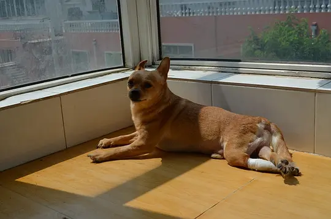

星星  
——2008-06-10 17:58:45 

宜家（星星之女）  
——2008-06-10 17:59:25 

樂(批话多。) 2010-05-27 18:16:42  
我喜欢她 和我家狗狗挺像

Dasha 2010-05-28 10:09:24  
养这种狗狗安全，不会上饭桌偷吃。  
问候周羽，如有闲暇，请看https://www.douban.com/group/topic/11564056/ 最后一贴，Dasha的解读是否正确。拜谢

子衿（被车撞断脊柱被弃被收留）  
——2008-06-10 18:00:12 

晓惠（流浪猫所生）  
——2008-06-10 18:01:03 

Mr.木月(不负如来不负卿) 2010-10-30 19:13:55  
它背后还有两只小白猫 真可爱

Dasha 2010-10-30 19:28:20
看得真细，地板革上的破碎处，就是它们挠的

采采卷耳 2011-08-06 22:02:08  
都是你收养的么，钦佩

[已注销] 2012-02-05 00:39:28  
这个相册里这么多猫，相册名应该改为katzen吧？

Dasha 2012-02-05 00:52:03  
应该是Katzen，但最初为了叶尾韵，也就一直没改

菊衣（锅炉房拆啦因此无家）  
——2008-06-10 18:01:52 

个人资料 2009-06-26 11:40:14  
?!这只超象迈克!!! （日本动画片《怪猫迈克》，小神龙俱乐部放过大说，英文片名好象是WHAT'S MICHAEL）

为啥它的眼睛那么圆啊,哈哈,你们家的猫真多,它们不打架么?

Dasha 2009-06-26 12:37:24  
打，亲父子、亲兄弟无差别混战。为了隔离他们，Dasha时时注意关门，如今赤日炎炎，正准备再添一个空调:-(
菊衣同学除了抻着JJ四处乱尿、乱搞外，是能懂人话、会跟人贱、不记人仇的乖乖猫

伯玄（晓惠与菊衣长子）  
——2008-06-10 18:03:04 

仲君（晓惠与菊衣次子）  
——2008-06-10 18:04:17 

淑颜（晓惠与菊衣之女）  
——2008-06-10 18:05:37

家有斯芬克斯  
——2009-06-23 15:50:47 

个人资料 2009-06-23 17:04:21  
!!!!!!!!!!!!!!

我喜欢我喜欢我喜欢!!!!!!!!!!!!

额,眼神有点Hercult POIROT状^_^

Dasha 2009-06-23 18:18:03  
不过，还是担心该猫因毛色会被“绿坝”

个人资料 2009-06-24 11:56:20  
一口中饭差点喷出,您不是有"每日更新的绿坝ip库完全破解版"地么,和和和和^0^

Dasha 2010-05-27 17:40:04  
2009年7月10日10时许，“菊衣”病逝于求医中，享年不详。

2009年7月1日傍晚遭遇车祸失去主人的无名狗（7月3日摄于某宠物医院），右前腿缝了33针，医生最终判定须截肢。  
——2010-05-27 17:27:53 

2010年5月27日“开开”在阳光下。Dasha拒绝为其截肢，名之为“开泰”（因当时面容类似羔羊），转院，“开泰”大约打了一个月的滴流，最后失去两根脚趾，被植皮，如今只在狂奔之后方现跛态。  
——2010-05-27 17:27:58 

个人资料 2010-05-27 22:33:09  
我的天啊，你们家除了一堆猫，还有狗狗的啊，它们不打架么？！

Dasha 2010-05-28 10:20:17  
所以都很健康成长。俺家“大开”像《丁丁历险记》里的老“白雪”不？他天天要跟伯玄咬一会儿，直到伯玄吱哇乱叫跳上高处。

Adieudusk(雲銜天笑明，雨帶星精落。) 2011-10-29 10:10:01  
Dasha好人
 
希尔达 2012-11-12 23:38:58  
感动

拒绝与人交流的阿散蒂（2009年10月12日摄）。菊衣的第二胎留下家中唯一一个。因其幼时毛棕色，名之为“阿散蒂”。阿散蒂人，Aschanti（德），Ashanti（英），Achantis（法）。  
——2010-05-27 18:02:39 

个人资料 2010-05-27 22:32:01  
？？你们家菊衣不是只淡黄色的花猫么？！难道是因为阿散蒂的妈妈？不过你们家阿散蒂的毛象绸缎一样黑亮，漂亮萨～～～

Dasha 2010-05-28 10:15:15  
阿散蒂、伯玄（阿散蒂之长兄）他们的妈是晓惠（ https://www.douban.com/photos/photo/103964473/ ）。白猫，自幼入门，未曾出去过，因此曾很替“大菊”郁闷。不过，前两天似乎中原地带也有牛生犊而肤色异，疑遭环境污染，乃稍释然。

——2010-07-11 15:51:57 

——2010-07-11 15:53:16 

——2010-07-11 15:54:42 

造型  
——2010-10-30 21:22:31 

卢沟晓月  
——2010-10-30 21:23:22 

Runia(Less is More) 2012-04-23 22:58:39  
Hunde在哪里

Dasha 2012-04-24 02:50:14  
Hunde最多能上到下面的桌子

不许拍照  
——2010-10-30 21:23:50 

镇宅1  
——2010-10-30 21:24:12 

镇宅2  
——2010-10-30 21:26:04 

个人资料 2011-07-06 12:13:22  
帅！真漂亮，还有那双蓝宝石一样的眼珠子，喜欢啊喜欢～～～

Dasha 2011-07-06 12:44:30  
现在是这德性：https://www.douban.com/photos/photo/1089711257/

天好还不领我出去玩儿  
——2011-07-03 15:12:32 

只喝流水，因为古人云女人是水做的  
——2011-07-03 15:12:48 

yiming 2012-01-30 10:21:41  
哈哈~那小舌头！

Dasha 2012-01-30 10:25:40  
舔你的时候就锋利啦

窗外是什么  
——2011-07-03 15:13:00 

禁止拍照  
——2011-07-03 15:13:10 

我爱我家  
——2011-07-03 15:13:24 

高处不胜寒  
——2011-07-03 15:13:35 

无耻睡相  
——2011-07-03 15:13:50 

Adieudusk(雲銜天笑明，雨帶星精落。) 2011-10-29 10:12:15  
这是狗吗？这明明是一对乱线团加两颗珠子

Dasha 2011-10-29 10:32:38  
右前爪露出皮的部分，能证明其为昔日被车撞过的狗。

Adieudusk(雲銜天笑明，雨帶星精落。) 2011-10-29 10:39:09  
你家的这些宝贝好些像我丫头的玩具：）

Adieudusk(雲銜天笑明，雨帶星精落。) 2011-10-29 10:39:51  
我将来带丫头找你和嫂子玩去好不，我丫头一定爱死你们家。

Dasha 2011-10-29 10:47:55  
欢迎之至。不过，夏天还好，冬天会有动物们的气味的，如来，请自备防毒面具。

Adieudusk(雲銜天笑明，雨帶星精落。) 2011-10-29 10:51:21  
防毒面具？人家会以为我们去你家打劫呢。臭臭不臭，我们先把自己弄臭了再去骚扰：）

罹患皮肤病，听说要上药，于是乎我……  
——2011-07-06 11:22:44 

我家关海法  
——2011-11-29 16:36:50

大厦将倾  
——2011-11-30 22:16:38 

Adieudusk(雲銜天笑明，雨帶星精落。) 2011-11-30 22:18:09  
你家这个小东西真会找地方

Dasha 2011-11-30 22:25:31  
嗯，书柜上面，狗狗不着，不过此刻里面是两只白猫，你仔细看，后面还有一只黑眼睛

Adieudusk(雲銜天笑明，雨帶星精落。) 2011-11-30 22:32:23  
是小猫仔吧，把纸筒自己拖上去的吗？太可爱了。后面那个看着表情还要乖柔。

2011年12月28日0点26分，猫的写作  
——2011-12-28 00:28:07 

Adieudusk(雲銜天笑明，雨帶星精落。) 2011-12-28 00:33:27  
猫写得这么美？算了，灭绝诗人们得了，起码猫比大多数诗人长得好看。

Dasha 2011-12-28 00:45:40  
踏出了“的话具有”、“德汉”、“的话”、“得获”、“得很”这些词，至少也算臧否文字吧

Adieudusk(雲銜天笑明，雨帶星精落。) 2011-12-28 00:54:24  
猫比孩子看来赖皮。我打字的时候，丫头做我怀里，哄上两句，乖乖就被撵走了。