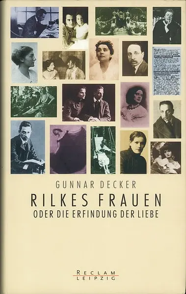
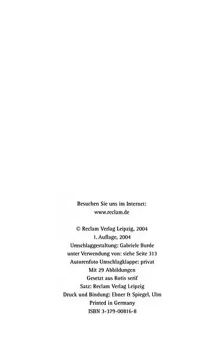
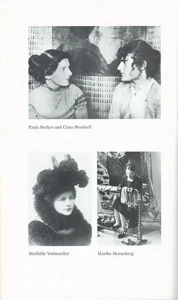
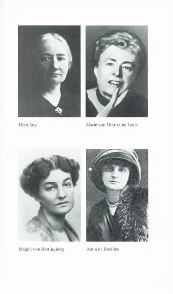
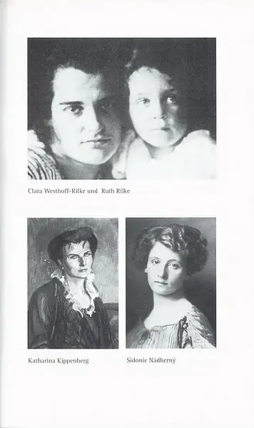
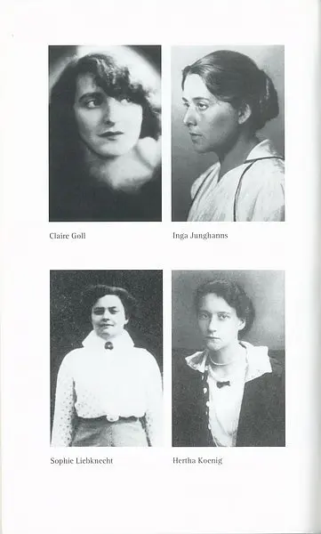

Rilkes Frauen oder Die Erfindung der Liebe. von Gunnar Decker. Reclam Verlag Leipzig, 1. Auflage, 2004. ISBN 3379008168

2009-03-19 18:00:53 创建

——2009-03-19 18:01:19 

——2009-03-19 18:01:22 

——2009-03-19 18:01:23 

——2009-03-19 18:01:27 

——2009-03-19 18:01:30 

——2009-03-19 18:02:01  

何家炜 2009-03-19 23:43:41  
《献给一位女友的安魂曲》，就是献给Paula Becker吧？

Dasha 2009-03-20 00:27:49  
还有“Der Sänger singt vor einem Fürstenkind”（歌者在王侯之子面前歌唱）

——2009-03-19 18:02:03 

——2009-03-19 18:02:05 

——2009-03-19 18:02:07 

——2009-03-19 18:02:09 

——2009-03-19 18:02:30 

——2009-03-19 18:02:32 