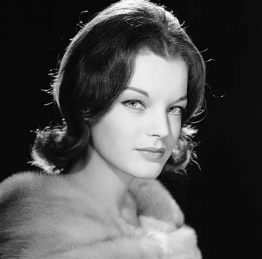

看见她，人们总会想起另一个女人。这，不知是她的悲哀，还是她的幸运。 http://www.celebs101.com/celebrity-Yvonne+Catterfeld-2496--wallpaper.html 目前有98张（20080829）  

2008-08-30 17:35:28 更新

——2008-08-29 20:26:12 

——2008-08-29 20:26:56 

——2008-08-29 20:27:37 

——2008-08-29 20:27:57 

——2008-08-29 20:28:29 

——2008-08-29 20:29:25 

——2008-08-29 20:29:49 

——2008-08-29 20:31:57 

Romy Schneider  
——2008-08-30 17:35:28 

Elihu 2008-11-25 15:33:11  
dasha兄，这个好像驾鹤了吧~~~

Dasha 2008-11-25 15:44:45  
这张，Dasha已经给出芳名：Romy Schneider。Yvonne Catterfeld主演她，在明年即将公映的电影里。所以Dasha在相册首页说：  
看见她，人们总会想起另一个女人。这，不知是她的悲哀，还是她的幸运。 