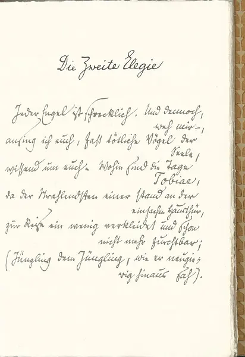

Das Buch hat 292,- Euro gekostet, Postgebühr war 8,05 Euro.

2010-02-28 19:23:25 创建

谁，我呼号之际，究竟谁会在天使之列将我垂听？我呼号，即使我已料到  
——2010-02-28 19:25:21 

每位天使都令人恐怖。然而我还是，哀哉，  
还是要歌唱你们，几乎致人死命的灵魂之鸟  
——2010-02-28 19:25:24 

Orpheus 2012-07-02 21:18:25  
这首dasha译的真好~有没有这首完整的翻译呢？

Dasha 2012-07-02 21:34:15  
咦，俄耳甫斯兄仅从起句就判断了全诗。十首“哀歌”里Dasha目前只满意《第十哀歌》的第一节。这不，今天刚到手https://book.douban.com/subject/10864591/（《杜伊诺哀歌的诗律》），Dasha正在着手最后的修订。乞兄再给Dasha一些时日，希望最终不至于令兄失望。

Orpheus 2012-07-02 23:49:16  
恕某愚见，这首的“哀哉”还有下一首的“痛哉”，这样穿插着一断一续读起来很是别致（这种别致的感觉到底是什么一时实在说不出），以我的保守之见，在汉语中把插入语放在这样的位置实在是很难做到连贯流畅，但这句读来却十分精巧，没有感觉到外语句法的生涩之感，比林克的“可我多么不幸，我歌咏你们”更有味道。Dasha兄如此勤勉另后生佩服，对我来说十四行诗就已经很有难度，面对哀歌则只能叹力之不足了，只可惜不懂德语，尽管林克的译本曾让我得些益处，但是也未尽如人意，只等Dasha兄重新修订，以满足某对汉语里尔克的渴望。

歌唱所爱的人是一回事。而歌唱那位，痛哉，  
那位藏匿着的负罪的血之河神却是另一回事。  
——2010-02-28 19:25:29 

生命之树啊，何时冬季啊？  
我们并不意见一致。我们不像候鸟  
——2010-02-28 19:25:33 

可他们是谁，告诉我，这些流浪艺人，这些比我们  
还要些许流离的人，他们早早就被急切地  
——2010-02-28 19:25:37 

无花果树啊，我感到意味深长已何其久，你几乎全然略过花期，  
——2010-02-28 19:29:36 

不要再鸣求，过度成长的声音，鸣求并不是，  
并不是你鸣叫的本性；尽管鸣叫的你纯粹如鸟  
——2010-02-28 19:29:42 

以一切眼睛，受造之物观看  
敞开。惟有我们的眼睛仿佛  
——2010-02-28 19:29:48 

为何，倘若可以忍受就这样化作月桂  
度过此在的期限，比所有其他的绿色  
——2010-02-28 19:29:54 

愿我有朝一日，在狂怒洞见的终点， / 向嘉许的众天使唱出欢呼与礼赞。 / 愿清晰敲击的心灵之槌 / 无一误落在纤软、犹疑或者 / 骤急的琴弦。愿我泫然的容颜 / 让我更显光彩；愿不被注意的哭泣 / 开花吐艳。  
——2010-02-28 19:29:59 

no9ronaldo 2012-08-18 02:19:57  
咦，记得Dasha原来是用的“苛刻考验”？刚才查了查，“苛刻”对应的德文是grimmig，显然和英文grim同源，两兄弟既有凶、怒之义，也有严厉、难以对付之义（这不禁让我想起小学时的班主任），为何Dasha目前偏取“凶、怒”呢？是有过考证？

Dasha 2012-08-18 07:59:27  
学英语的时候应该老师总说不要用汉语思维来使用英语，那会是中式英语，同理，莫用英语思考德语，德语的grimm[ig]与英语的grimm并不一致。而将“Einsicht”汉译成“考验”（Prüfung），倒是选取词义太随意。此句的详细解读见 https://book.douban.com/subject/4282089/ 第327页。