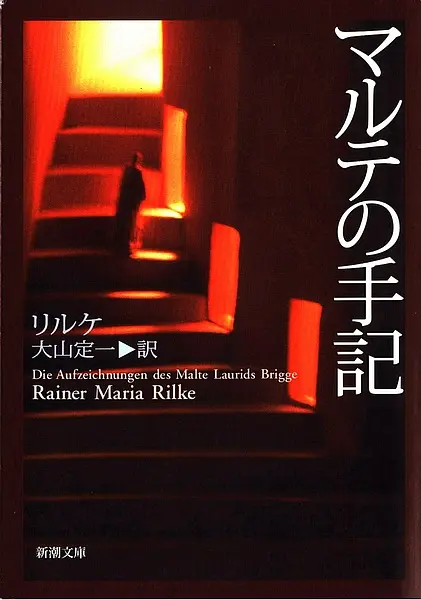
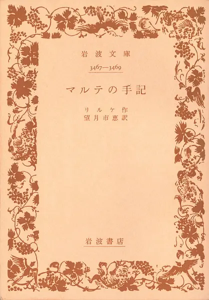
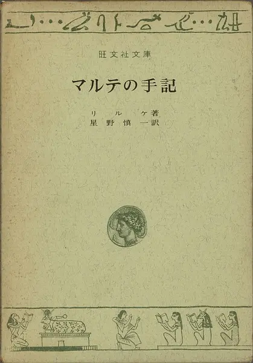
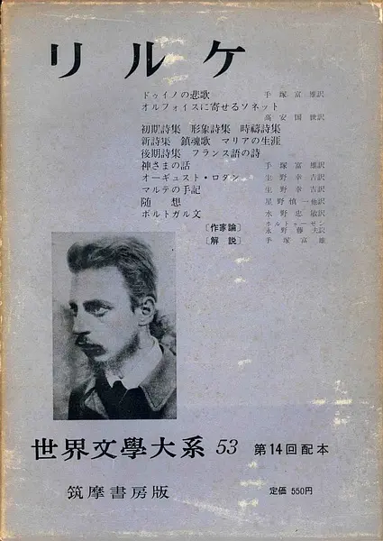
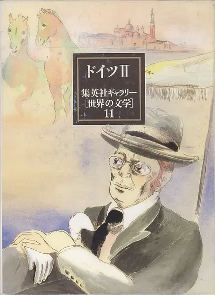
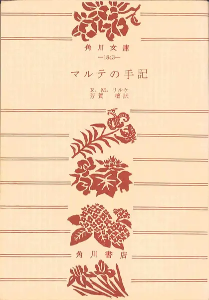
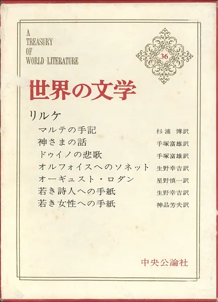
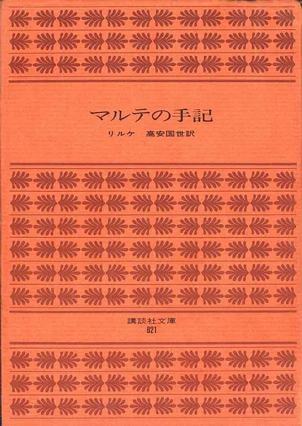
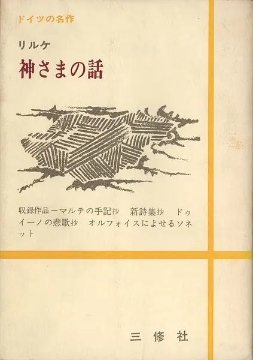
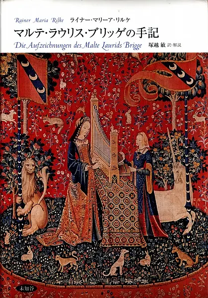

Die Aufzeichnungen des Malte Laurids Brigge（布里格手记），2009年2月10日，Dasha应该算是搜集齐了全部“日訳本”（计10种，其中“竹内豊治本”为选译），是为之记。  

2009-02-11 17:12:51 创建

1939 - 大山定一(新潮社1953, 2001)  
——2009-02-11 17:14:20 

1946 - 望月市恵(岩波書店)  
——2009-02-11 17:15:33 

1954 - 星野愼一（旺文社1969）  
——2009-02-11 17:15:53 

1954 - 生野幸吉(筑摩書房1959)  
——2009-02-11 17:16:07 

1958 - 川村二郎(集英社1990)  
——2009-02-11 17:16:57 

1959 - 芳賀檀(角川書店)  
——2009-02-11 17:17:04 

1964 - 杉浦博(中央公論社)  
——2009-02-11 17:24:30 

1967 - 高安国世(講談社1971)  
——2009-02-11 17:25:00 

1970 - 竹内豊治(三修社)  
——2009-02-11 17:35:28 

1983 - 塚越敏(未知谷2003)  
——2009-02-11 17:36:59 