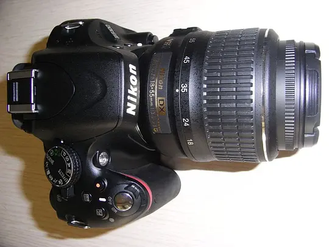

看完“NHKスペシャル 激流中国”最终章的“～環境破壊との闘い”，身为中国人，已经什么太多感觉，只是想起一个多月以前去丽江，在虎跳峡边上看到的被开发的模样：山石已经快堵住了金沙江，老虎跳那块石头干嘛，再过几年，恐怕人都能够趟过去了。  
——2008-07-17 11:01:47 

广州路13号 2008-07-17 15:33:24  
难得一见——去过丽江，没去虎跳峡。  

Dasha 2008-07-18 10:10:11  
那就下次与押司一起把臂游丽江

Große Stuttgarter Hölderlin-Ausgabe: 524,35+216,00=740,35 EURO (20 Febr., 2009)  
——2009-02-21 14:50:43 

遺民有扶桑(沪生不响。) 2009-05-16 23:44:34  
524是原價，216是運費？

Dasha 2009-05-17 01:03:14  
如果直接联系书商，再加上EMS，216欧元的运费恐怕最多只够一半。

雅恕斋 2010-06-25 10:41:38  
现在可以再看看法兰克福版了

Shanghai Tan(die Aufklärung- 悟りの光) 2010-07-11 23:56:46  
Wunderbar! Studieren Sie Literatur?

朝霞不出门 2010-12-11 13:51:11  
哈哈 我们学校有绿色封皮精装一套

朝霞不出门 2011-03-26 23:31:40  
请问dasha 这套书可以找到扫描版吗？或者其他的荷尔德林文集的德文扫描版？  

拜谢！

Dasha 2011-03-26 23:46:24  
朝霞兄容秉，StA的Bd. 1, 2扫描并OCR了，3, 4, 5只完成了扫描，还未纠偏、去污、OCR……，问题是，Google Books上都有，Dasha也就兴味索然。

Dasha 2011-03-26 23:47:39  
绿色封皮的，应该是FHA，Dasha只低价买了一本解馋：https://book.douban.com/subject/4062919/

朝霞不出门 2011-03-26 23:52:21  
dasha果然大手笔！  
再次拜谢！

和亚丁谈里尔克 程抱一著 台北：纯文学出版社，民国六十一年初版. 纯文学丛书41  
——2010-06-21 16:46:52 

那么南(二十世纪已经过去了)  2011-11-23 16:41:44  
不知道有没有电子版啊

何家炜 2012-07-09 10:52:43  
简体字新版：https://book.douban.com/subject/10589313/

Dasha 2012-07-09 11:04:30  
等美眉给Dasha邮样书呢

何家炜 2012-07-09 11:15:33  
说是早就快递的、、怎么还没收到、

Dasha 2012-07-09 11:16:52  
尚未收到哇，是中国邮政？

何家炜 2012-07-09 11:21:26  
不是、应该是圆通快递、在让前台查了、

Dasha 2012-07-09 11:25:15  
受累了

和亚丁谈法国诗 程抱一著 台北：纯文学出版社，民国五十九年初版. 纯文学丛书30  
——2010-06-21 16:47:59 

林玑(见饭愁) 2010-06-22 22:31:52
民国六十一年？1973年？

Dasha 2010-06-23 00:31:44
是民国五十九年（1970年），六十一年是“谈里尔克”

还好，蒙出是哪首诗了。来源：http://book.douban.com/subject/2285315/ ，书中所夹Rilke-Gesellschaft的广告折页。  
——2010-08-08 01:26:07 

公子小白 2010-10-14 15:32:50  
Dasha同学，你的里尔克中文网都不更新了，翻译还在继续吗？期待里尔克后期作品的优秀中译本啊。想当年在学校的时候整理你翻译的那些作品，那个网站又不能复制，我就只好一页页地打开源文件，把里面的中文复制下来，然后再删掉间隔符号，再分行，好不容易整理好了，自己编辑整理了一本里尔克的中译本在打印社里印刷出来，作为随身必备的读物。可惜的是《新诗集》、《俄耳甫斯十四行》还有《杜伊诺哀歌》你都没有翻译，只好找了别人翻译的补上。前几天看到你翻译的《安魂曲》又赶紧复制下来保存了，真不容易啊。《杜伊诺哀歌》比较了好几个译本，灵石的我感觉还不错，不知道你翻译出来的文本会怎么样，很期待。《俄耳甫斯十四行》国内的译本感觉都不太好。《新诗集》更是缺少一个完整的译本。希望Dasha同学给点力，早点把里尔克的最好译本公诸于世。我最喜欢的诗人，在中国居然找不到一个好的本子太可惜了。

Dasha 2010-10-15 09:13:14  
启禀桓公大王，得蒙垂爱，不胜惶恐。微臣驽钝，尚在继续：https://book.douban.com/subject/4863239/ 。里氏生前正式出版的诗集约略大致遍历，“哀歌”十首，尚待一位网友校读，“商籁”（上图即第一部第19首“没有认清痛苦”）第二部犹待德文解读。迄今众多文字不敢示众，大抵缘于日前读译里氏散逸诗稿，对里氏理解加深，一些字词，须前后一贯，方可暗示其毕生思想脉络，然一词一句，牵一发而动全身，傻之揜陋，一时难竟。况旧时译文，乖谬甚重，惜已流布网络，正视听之工程犹螳臂当车，悔哉悔哉。是以，尚请吾主别求佳译，或隐忍等待微臣。

公子小白 2010-10-15 19:13:05  
曩者风闻大傻兄译里氏之作意兴阑珊，恐兄搁笔，甚为叹惋，不意于豆瓣偶遇，荣幸之至，得悉工程不废，深感欣慰。翻译之难，不输稼穑，弟尝偶有染指，然体会颇深。里氏大家，万人瞩目，译本稍有乖舛不通之处，即为诟病，况诗之言辞，凿凿可堪，不独世人吹毛求疵，吾人尤耽自审，故大傻兄于译本斟酌再三，反复推敲，良有以也。里氏各家汉译本稍有涉猎，不满者甚夥，惜不通德语，无以识大音，吾不欲饥不择食，宁缺毋滥，欲坐等兄之佳译也。望大傻兄不辞辛劳，快马扬鞭，早呈佳肴于饥馑饿殍。

5099元在京东败了个尼康D5100，今天中午刚到，阴天，拍张1333 Euro败的FHA，没用三脚架
投诉  
——2011-07-02 16:22:56 

erophobia 2011-07-02 16:51:50  
哈哈，不错，书比相机贵。这种静物不需要三角架吧，dasha兄。。。你有一双颤抖的双手。。。好里尔克，哈哈  

叶一野 2011-07-02 17:05:28  
尼康和佳能 有区别么  

Dasha 2011-07-02 17:25:07  
erophobia：FHA捧不动（3包，每包都近15Kg），Nikon还行。颤抖，是因为“鸡冻”哇  
to_be：性能应该差不多，Dasha只是喜欢Nikon拍出来的色彩。

Nikon D5100，5099元，赠三脚架1个。诚如此前网友感慨，在京东购物犹如买股票。当京东5099元附赠2赠品时我错过了。后来，5399了，再半天，又5099赠三脚架，于是下单。一念之差，多花了99块钱（买卡）。  
——2011-07-02 16:31:38 

——2011-07-09 13:11:01 

http://book.douban.com/subject/1057434/，311页  
——2011-08-02 16:44:48 

雪后  
——2011-11-23 16:35:23 

Mein Studierzimmer mit Katzen  
——2011-12-18 09:56:34 

Adieudusk(雲銜天笑明，雨帶星精落。) 2011-12-18 10:44:25  
那个怎么那么爱藏？这个简直照影自恋的身姿吗：）

Dasha 2011-12-18 11:01:35  
一位豆友诚心送里尔克的原版书给Dasha，感激之余，Dasha头痛书籍已满 

Adieudusk(雲銜天笑明，雨帶星精落。) 2011-12-18 11:02:41  
你这是拍人家送的书感谢呢，还是拍猫呢？

Dasha 2011-12-18 11:45:43  
猫不会人语，但愿意舔书

M 2011-12-18 22:28:37  
Dasha 你喜欢这种不锈钢的书柜呀

Dasha 2011-12-19 15:13:12  
主要是有玻璃门防尘，此前打的木书架都塌腰了

“跳票”到2012年春。等待以之整理书架：http://www.ionaudio.com/products/details/book-saver  
——2011-12-18 10:14:40 

婷婷要做甜娘☆(用键盘守护萌与正义的萌豚) 2011-12-18 14:32:17  
这个东西国内能买到么。。。
 
Dasha 2011-12-18 15:18:49  
淘宝数月之前就有代购：http://item.taobao.com/item.htm?id=12329115057
可是，人家根本还没上市呢
 
婷婷要做甜娘☆(用键盘守护萌与正义的萌豚) 2011-12-18 18:55:41  
嗯。嗯 Dasha兄到时候要是有方便渠道买这个 请告诉我一声行么。
 
Dasha 2011-12-19 15:11:09
收到。其实，Dasha也准备求相熟的在美国的豆友代为购买呢
 
婷婷要做甜娘☆(用键盘守护萌与正义的萌豚) 2011-12-22 10:37:19  
多谢多谢~  

http://www.atiz.cn/  
——2011-12-18 10:16:53 

“怪谈物语”。两位都是研究日耳曼文学的，却不用独语交流  
——2012-01-29 07:45:10 

$16.80：R. M. Rilke, The Lay of Love and Death of Cornet Christopher Rilke, Translated by Leslie Phillips and Stefan Schimanski  
——2012-04-22 09:00:23 

Adieudusk(雲銜天笑明，雨帶星精落。) 2012-04-22 09:14:23  
全本插图？

Dasha 2012-04-22 09:43:39  
很激动人心的插画，可惜就这个扉页有。貌似是里尔克的《掌旗官》第一种英译，所谓前辈译文吧，极其糟糕，稍微有语法疑义的地方，就跳踉而过。真不明白Amazon上怎么还有卖到115美刀的。
https://book.douban.com/subject/7053364/ ，这是百年纪念版，文字介绍说有一些插图，书已经在德国到中国的天空中了，到手后扫描插图给你看吧，Dasha买了精装、平装各一种。
 
Adieudusk(雲銜天笑明，雨帶星精落。) 2012-04-22 09:54:38  
你怎么这样买书呢？可知收藏也是一种贪欲？  

可我等着你的插图吧，到时候和你的译文我一起排一下，可以做个小册子自娱呢。

看音乐  
——2012-07-09 10:47:54  

何家炜 2012-07-09 10:50:43  
果然美女啊、、

Dasha 2012-07-09 11:03:53  
根儿在这儿：https://www.douban.com/people/adieudusk/status/964798858/
所以Dasha说他不通音乐，是在看美女的沟沟  
美女是波兰人，羽管键琴手Wanda Landowska

个人资料 2012-07-09 11:17:27  
哈哈哈哈哈哈哈~~~~~~~~~~~

何家炜 2012-07-09 11:23:55  
dasha这种猜测、的前提、是要确定美女穿的是低胸深V啊、、否则只能看个颈脖、、

Dasha 2012-07-09 11:26:51  
最是那一低头的温柔

何家炜 2012-07-09 11:33:17  
哈哈、、YY着里的YY、、屌丝着里的屌丝、、

个人资料 2012-07-09 11:40:05  
何同学，女生的颈脖也属于性感部位哦，特别是这种白晰修长微露琐骨的颈脖~~~~

何家炜 2012-07-09 12:35:54  
、、、白晰修长微露琐骨的颈脖、、、求看、、、

个人资料 2012-07-09 12:52:11  
自己YY........

看世界  
——2012-07-09 10:47:56 

Adieudusk(雲銜天笑明，雨帶星精落。) 2012-07-09 11:02:31
哈哈，笑得确实傻

Dasha 2012-07-09 11:05:33  
笑靥如花

尚友躺平(a wastrel) 2012-07-09 11:03:42  
哈哈，DASHA 惜字如金

Adieudusk(雲銜天笑明，雨帶星精落。) 2012-07-09 11:04:50  
呵呵，里尔克的世界由女人，女人，还是女人构成！

Adieudusk(雲銜天笑明，雨帶星精落。) 2012-07-09 11:06:24  
真实一朵开烂了的丑花

何家炜 2012-07-09 11:17:34  
你们不要这样啊、、  
这种笑肯定因为什么事或话语、、不会是因为色迷迷、、

Dasha 2012-07-09 11:25:56  
你不是说过人都是活到老色到了嘛，Dasha是绝对同意的

Adieudusk(雲銜天笑明，雨帶星精落。) 2012-07-09 11:21:22  
里尔克那眼神，绝对是锁定美女锁惯了。瞧修女多含蓄地避开了两圈聚光灯。

个人资料 2012-07-09 11:24:12  
你们这些人啊啊，这个MM看装束，应该是也犹太棱（至少是信犹太教地）瓦~~~~~~~

何家炜 2012-07-09 11:31:17  
这在镜头前、又不是演AV片、、哪个色狼这么傻呵呵啊、

Adieudusk(雲銜天笑明，雨帶星精落。) 2012-07-09 11:35:00  
当然是越老越色了，可以无视伪装了。叶芝不是说：

Through all the lying days of my youth  
I swayed my leaves and flowers in the sun;  
Now I may wither into the truth. 

MacBook Air MD224CH/A 7299+48  
——2012-07-24 13:03:19 

感谢沙门兄赠书  
——2012-08-06 10:31:50 

能工巧匠沙门哥(贾鸟德·喉塞音) 2012-08-06 10:35:27  
Dasha兄客气了：）

Dasha 2012-08-06 10:37:20  
不是客气，是欢喜

意外成就的“惊悚”：http://book.douban.com/doulist/86839/?start=50&filter=  
——2012-09-12 12:39:56 